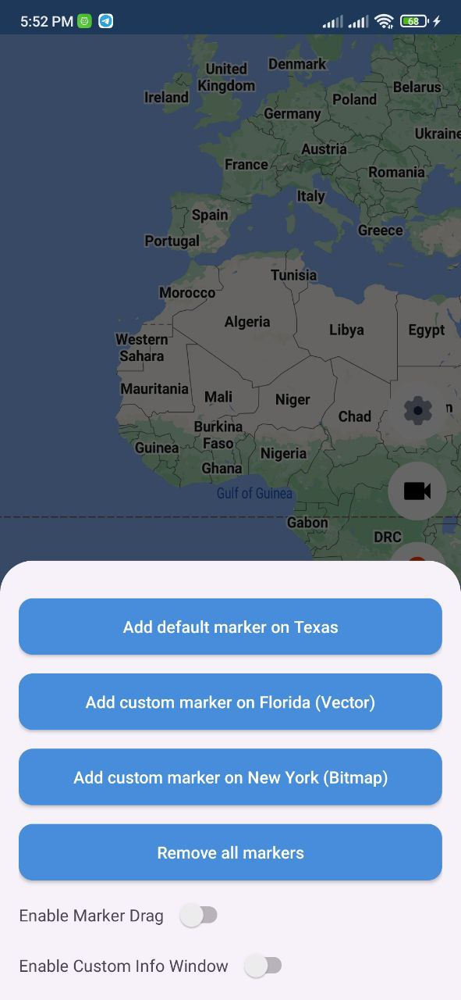
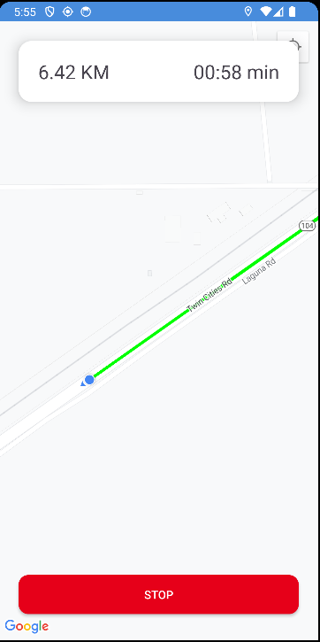

# Maps Playground

Maps Playground is an app for demo purposes, I collect on it most of the Maps API utilities that could be applied for Android.

You can download the app from MediaFire and try it.

## Screenshots

   
   
   
   
  
  
  
  
  
  

## 📚 Android tech stack

One of the main goals of Maps Playground is to try most of the Maps API utilities that are available for Android.

### 🧑🏻‍💻 Android development

- Application is entirely written in [Kotlin](https://kotlinlang.org)
- Asynchronous processing using [Coroutines](https://kotlin.github.io/kotlinx.coroutines/)
- Architectural pattern using [MVVM](https://en.wikipedia.org/wiki/Model%E2%80%93view%E2%80%93viewmodel)
- Maps SDK V2 [Maps](https://developers.google.com/maps)
- Maps Utility SDK [Repo](https://github.com/googlemaps/android-maps-utils)
- Permission Handling [Easy Permissions](https://github.com/googlesamples/easypermissions)

### Features ✨

- Maps Playground
  - General Settings Playground
      - enable/disable zoom controls
      - enable/disable zoom gestures
      - enable/disable scroll gestures
      - enable/disable rotate gestures
      - enable/disable compass
      - enable/disable toolbar
      - changing map type ( Normal - Satellite - Terrain - Hybrid - None )
      - changing map style ( Standard - Silver - Retro - Dark - Night - Aubergine )
        
  - Camera & Viewport Playground
      - changing zoom level (min = 1 , max = 20)
      - show buildings in 3D mode ( Changed camera tilt to 45 degrees )
      - move the camera without animation
      - animate camera to a specific location
      - move the camera to specific bounds
      - move the camera to a specific bounds and restrict the scroll

  - Marker Playground
      - add default marker to the map
      - add a custom vector image as a marker to the map
      - add a custom bitmap image as a marker to the map
      - remove all markers from the map
      - enable/disable marker drag ( long click on the marker you want to move to move the marker if enabled )
      - enable/disable custom info window ( single click on the marker you want to show its data to open the info window if enabled )
      - get the marker info by geocoder ( country name - country code - postal code - admin area - latitude - longitude )

  - Shapes Playground
      - Draw a custom polyline on the map
      - Draw a custom circle on the map
      - Draw a custom polygon on the map
      - Draw a polygon with a hole inside it
   

- User Tracker
  - Get the device location updates every second and update it on the map
  - Track the device location from the start point to the current point
  - Track the device location in the background even when the app is completely closed using foreground service
  - Calculate the distance traveled in Kilometers
  - Calculate the elapsed time during the trip in minutes
  - Show a polyline that represents the trip after finishing the trip

## Find this repository useful? :heart:
Support it by putting a star for this repository. :star:  
Also, __[follow me](https://github.com/3wiida)__ on GitHub for my next creations! 🤩
